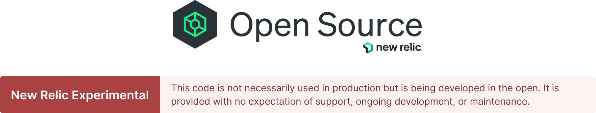

# Open Source `Category` README Requirements

This document provides the details on the open source category README requirements, including the markdown snippet that should be pasted into the top of a given `README.md` file.

## Category Headers

Every public repository in the `newrelic` and `newrelic-experimental` GitHub organizations must leverage one of the following categories.

- New Relic Experimental
- Example Code
- Community Project
- New Relic One Catalog Project
- Product Delivered in Open Source
- Archived

See the preview image and code snippets below.

## New Relic Experimental

[]()

### Code snippet

Copy and paste the following into the **top** of your project's README.

```markdown
![]
```